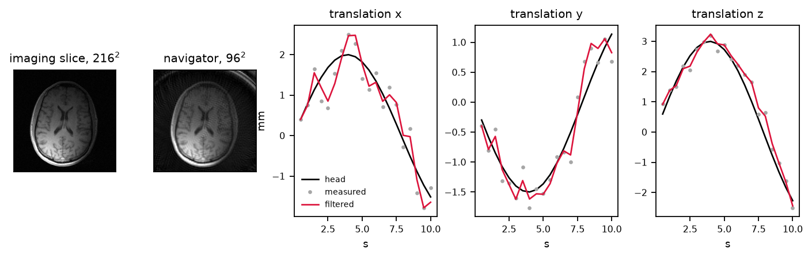

# mrmotion

Rigid motion estimation and tracking for MRI: a navigator's planes
reconstructed, registered and carried across the scan by an extended Kalman
filter, with every library held to one thread.

[](https://github.com/FiRMLAB-Pisa/mrmotion/actions/workflows/test-ci.yml)
[](https://codecov.io/gh/FiRMLAB-Pisa/mrmotion)
[](https://pypi.org/project/mrmotion/)
[](LICENSE)



*A brain slice from the [ISMRM motion-correction workshop](https://github.com/lab-midas/ismrm-moco-workshop),
the 96² navigator plane gridded from 96 golden-angle spokes of its k-space, and
the head's translation tracked across 20 navigators from three such planes.
Reproduce it with `python examples/figures/make_tracking_figure.py`.*

A navigator resolves six degrees of freedom out of images that are each only
two-dimensional. One plane sees the motion in its own plane — rotation about its
normal, translation along its two axes — and planes that between them span the
volume see all six. So the planes are registered against the first navigator
acquired, solved together for the pose that explains all of them, and carried
across the scan by a filter.

- **One thread, and it is checked rather than assumed** — prospective correction
  shares a machine with the reconstruction it steers, and owes it a pose before
  the next acquisition. A step that usually takes 20 ms and occasionally 200,
  because eight threads contended for a machine with none to spare, is worse
  than one that always takes 40. Four libraries take threads and each is told
  separately; `thread_counts()` reads them back so the tests assert them from
  inside the block
- **Each sample is weighted by how densely its neighbourhood was visited**, and
  the weights are estimated once, when the application learns the trajectory,
  because they are a property of the trajectory and not of the head. The
  analytic ramp is the usual shortcut and it over-weights exactly the outer
  k-space a navigator leaves sparse: on a 96² navigator of 96 golden-angle
  spokes it costs a factor of ten in the pose, 1.5° and 0.9 px against 0.1° and
  0.1 px
- **FINUFFT is told per call**, because it has no global to set — the count
  travels with the plan the navigator reconstruction builds, and there is a test
  that it arrives
- **The pose is solved as a rotation vector** and only then turned into Euler
  angles, which is exact. The approximation is upstream, and it is the one any
  2D registration rests on: a plane measures only the motion it can see
- **Nothing requires three planes, or requires them orthogonal** — what it
  requires is that the normals span the rotations and the in-plane axes span the
  translations

## Quick Start

```bash
pip install mrmotion
```

```python
import mrmotion as mm

# once, when the application learns the trajectory
density = mm.estimate_density(trajectory, shape=(64, 64))

# k-space along each plane -> plane images, FINUFFT on one thread
planes = mm.reconstruct_navigator(kspace, trajectory, (64, 64), density=density)

# planes -> a filtered pose, registered against the first navigator seen
tracker = mm.NavigatorMotionTracker()
pose = tracker.track(planes, axes, dt=0.1, spacing=10.0)

# or hold something else of your own to one thread
with mm.single_threaded():
    ...
```

## Examples

The `.py` beside each notebook is the source — it runs as a script and lints
with the rest of the package, and `scripts/build_examples.sh` is what turns it
into the notebook.

| | | |
|---|---|---|
| [`01-navigator`](examples/01-navigator.ipynb) | k-space to a plane: what the trajectory's extent sets, what the density weighting is worth, and coils | [](https://colab.research.google.com/github/FiRMLAB-Pisa/mrmotion/blob/main/examples/01-navigator.ipynb) |
| [`02-tracking`](examples/02-tracking.ipynb) | six degrees of freedom from three planes, `process_noise`, and the latency of one navigator | [](https://colab.research.google.com/github/FiRMLAB-Pisa/mrmotion/blob/main/examples/02-tracking.ipynb) |

## What it costs

One core, no GPU, three planes per navigator, measured by
`python scripts/benchmark_latency.py` (a 4060 Laptop's CPU; run it on yours):

| | 64², 1 coil | 64², 8 coils | 96², 1 coil | 96², 8 coils |
|---|---|---|---|---|
| density, once at start-up | 123 ms | — | 208 ms | — |
| grid one plane | 1.2 ms | 6.2 ms | 1.4 ms | 10.7 ms |
| register one plane | 11.9 ms | 10.0 ms | 12.1 ms | 12.0 ms |
| **a whole navigator** | **52 ms** | **76 ms** | **94 ms** | **121 ms** |

Gridding runs at about 7 Msample/s and scales with the samples, so the coil
count multiplies it and the matrix size barely moves it. Registration costs
several times more than the gridding of the same plane and does not care how
many coils fed it, which is what sets the budget: a navigator every half second
spends a fifth of a core.

A converged density is what buys the right to grid at all. A 20-iteration CG
reconstruction of the same planes measures the pose to 0.05° and 0.11 px; the
weighted adjoint reaches 0.10° and 0.11 px for 1/47 of the per-navigator cost,
having paid its 200 ms once.

## Related Works

- **SimpleITK** — <https://simpleitk.org/>. The rigid registration each plane is
  measured with.
- **FINUFFT** — <https://finufft.readthedocs.io/>. What grids the navigator.
- **mri-nufft** — <https://mind-inria.github.io/mri-nufft/>. Its implementation
  of the Pipe–Menon fixed point is what `estimate_density` runs.
- Pipe JG, Menon P. *Sampling density compensation in MRI: rationale and an
  iterative numerical solution.* Magn Reson Med 1999;41:179-186.
- **`lab-midas/ismrm-moco-workshop`** —
  <https://github.com/lab-midas/ismrm-moco-workshop>. Hands-on motion estimation
  and correction, and the basis for the example.
- Maclaren J, Herbst M, Speck O, Zaitsev M. *Prospective motion correction in
  brain imaging: a review.* Magn Reson Med 2013;69:621-636.

## Development

```bash
pip install -e .[dev]
bash scripts/format_and_lint.sh
pytest -q
bash scripts/build_examples.sh    # rebuild the notebooks and their figures
```
